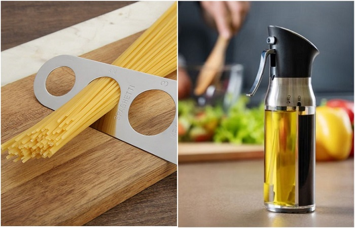
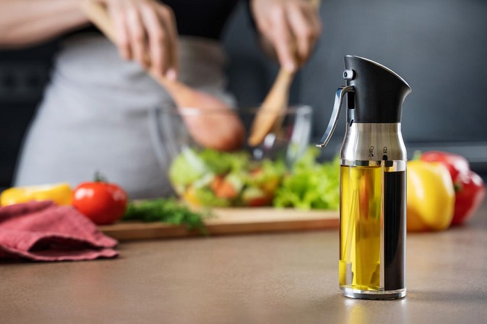
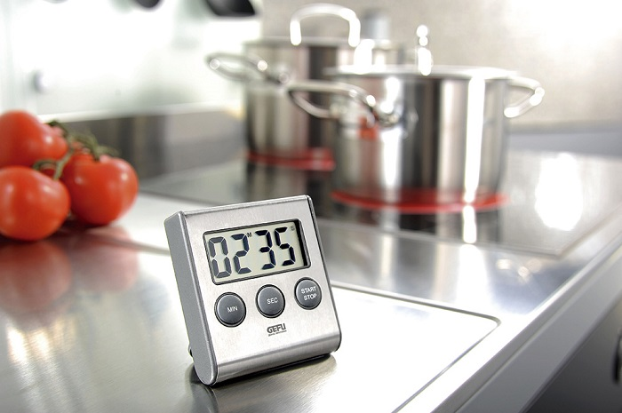
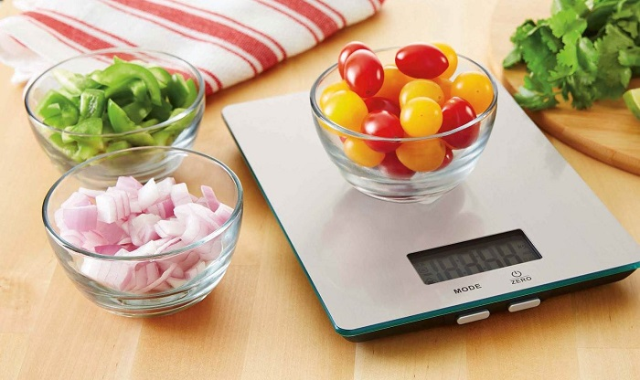
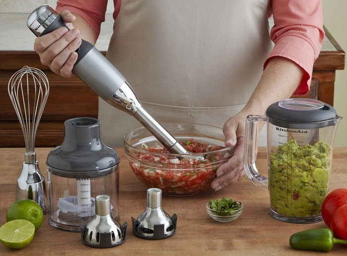

# Kitchen appliances that make cooking a breeze

Both girls and men love cooking, because it is a very interesting and exciting process. But after a hard day's work, you only have enough energy to quickly boil spaghetti or buckwheat porridge and chop up a salad in five minutes. In order to ensure that the process of cooking food did not become a torture, and was as simple and fast as possible, pay attention to a selection of useful gadgets from Novate.ru.

## Gadget 1: Spray dispenser

Vegetable oil and vinegar are indispensable things in any kitchen. Even if you use a non-stick frying pan, you still sometimes want to add nutritional value to fried dishes. That's what the spray dispenser is for. In addition to making the process of using oil more convenient, the gadget also distributes oil in a thin layer in the pan. This reduces the amount of fat, lowers the calorie content of the dish and preserves the natural flavor of the food.

## Gadget 2: Timer

Most hostesses don't consider this an essential item - and for good reason. Remember how many times you forgot broth on the stove or meat on the pan, and then unsuccessfully tried to restore their taste. The timer will allow you to keep everything under control and once again do not worry that you will go, for example, do homework with the child, and the casserole in the oven will turn into embers. Of course, you can use the clock on your phone for your purposes, but where a guarantee that you will not be distracted by SMS or forget the time, or even forget where you put your smartphone. A timer, on the other hand, will always chime in at the right time.

## Gadget 3: Kitchen Scale

Kitchen scales are not only a paradise for pastry chefs, but also for people who calculate the nutritional intake and are committed to proper nutrition. It can be both an ordinary device and one with an additional set of functions. For example, some gadgets are able to remember the weight of the product, calculate the volume of liquid, weigh products without regard to the weight of the bowl (tarocompensation) and so on. But weighing everything "by eye" is a bad idea in advance. The cakes may turn out to be clogged because you've gone overboard with the flour, and the portion of rice is more calorie-dense, as you'll eat 180 grams instead of 100 grams.

## Gadget 4: Hand blender

The blender is a versatile appliance that is hard to do without in the kitchen. Not only can it whip eggs with sugar and help make dough, but it can also crush nuts for peanut butter or almond milk, chop vegetables for soup puree, and make a healthy kefir smoothie. Any whim! All you need to do is to put the necessary ingredients into the bowl and press the "start" button. Unlike a stationary blender, the immersion model takes minimal space in the kitchen and allows you to cook in any dish, as long as it has high walls. Another advantage of such a blender is that it is much easier and faster to clean. That is, you can save time and effort, which is not unimportant if you have had a hard day and need to cook dinner.

